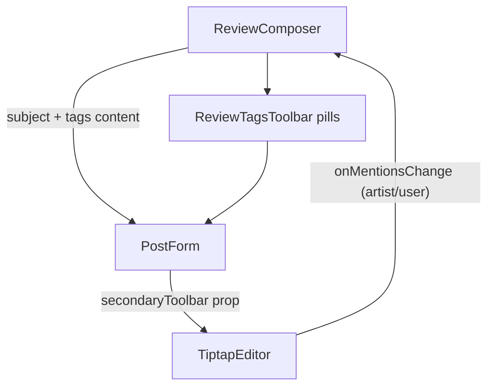

## Is this supported already?

No. The composer stack is `ReviewComposer` -> `PostForm` -> `TiptapEditor`. The "Format" pill and its collapsible toolbar are hardcoded inside [packages/ui/src/components/tiptap-editor.tsx](packages/ui/src/components/tiptap-editor.tsx) (lines ~766-814) and there is no API to add a second pill, no way to surface the review subject, and no callback that reports artist mentions. So all three pieces need to be built.

## Data available

- Review subject (artist + track/release name): `SelectedMusicSubject` in [packages/scilent-ui/src/components/review/MusicSubjectPicker.tsx](packages/scilent-ui/src/components/review/MusicSubjectPicker.tsx) exposes `type`, `title`, `artistLabel`. `ReviewComposer` already holds this in `subject` state.
- Artist mentions: live in the editor doc as `artistMention` nodes (attrs `id`, `label`); user mentions are `userMention` nodes. These are currently never surfaced upward.

## Data flow



## 1. Make `TiptapEditor` extensible (generic, in `packages/ui`)

In [packages/ui/src/components/tiptap-editor.tsx](packages/ui/src/components/tiptap-editor.tsx):

- Export two new types:

```ts
export interface EditorMention {
	id: string;
	label: string;
	type: 'user' | 'artist';
}
export interface SecondaryToolbar {
	label: string;
	ariaLabel?: string;
	icon?: React.ReactNode;
	content: React.ReactNode;
}
```

- Add props `onMentionsChange?: (mentions: EditorMention[]) => void` and `secondaryToolbar?: SecondaryToolbar | null`.
- Store `onMentionsChange` in a ref (mirroring the existing ref pattern in this file) to avoid a stale closure inside the `useEditor` `onUpdate`.
- In `onUpdate` (line ~724), after the existing `onChange`, walk `editor.state.doc.descendants(...)` collecting `userMention` / `artistMention` nodes into `EditorMention[]` (dedupe by `type+id`) and call `onMentionsChangeRef.current?.(...)`.
- Add `const [showSecondary, setShowSecondary] = React.useState(false)`.
- In the footer row (line ~767), wrap the existing Format `<button>` and a new secondary `<button>` in a left `flex gap-2` group. The new pill reuses the Format pill's exact class recipe (`text-xs text-muted-foreground ... showSecondary && 'text-foreground bg-brand/10'`, `aria-expanded={showSecondary}`), rendered only when `secondaryToolbar` is set, showing `secondaryToolbar.icon` + label.
- Add a second collapsible container after the toolbar container (line ~814), same `overflow-hidden transition-all duration-200 ease-out` pattern but `max-h-40 overflow-y-auto` (tags wrap), rendering `secondaryToolbar.content` inside a `px-2 py-1.5 border-t border-border/50 bg-muted/30` wrapper.
- Re-export `EditorMention` / `SecondaryToolbar` from [packages/ui/src/index.ts](packages/ui/src/index.ts) (line ~17 block).

## 2. Thread props through `PostForm`

In [packages/ui/src/components/social/post-form.tsx](packages/ui/src/components/social/post-form.tsx): add `onMentionsChange?` and `secondaryToolbar?` to `PostFormProps` and pass them straight into `<TiptapEditor>` (line ~79).

## 3. New `ReviewTagsToolbar` presentational component

Create `packages/scilent-ui/src/components/review/ReviewTagsToolbar.tsx` (client component). Props: `subject: SelectedMusicSubject`, `artistMentions: EditorMention[]`. Renders a `flex flex-wrap gap-1.5` of non-interactive `Badge` pills (`@scilent-one/ui`, `variant="secondary"`/`"outline"`):

- One pill for `subject.artistLabel` (artist).
- One pill for `subject.title` (labeled Track or Release via `subject.type`, e.g. a small `Music2` icon).
- One pill per artist mention `label`, deduped case-insensitively against `subject.artistLabel` (small `User`/artist icon).

Export it from the scilent-ui review barrel / package index.

## 4. Wire up in `ReviewComposer`

In [packages/scilent-ui/src/components/review/ReviewComposer.tsx](packages/scilent-ui/src/components/review/ReviewComposer.tsx):

- Import `EditorMention` type from `@scilent-one/ui` and the new `ReviewTagsToolbar`.
- Add `const [mentions, setMentions] = React.useState<EditorMention[]>([])` and a stable `handleMentionsChange = React.useCallback(setMentions, [])`.
- Derive `artistMentions = mentions.filter(m => m.type === 'artist')`.
- Build `secondaryToolbar` only when `subject` exists:

```tsx
const tagsToolbar = subject
	? {
			label: 'Tags',
			icon: <Tags className="w-3.5 h-3.5" />,
			content: (
				<ReviewTagsToolbar subject={subject} artistMentions={artistMentions} />
			),
		}
	: null;
```

- Pass `onMentionsChange={handleMentionsChange}` and `secondaryToolbar={tagsToolbar}` to `<PostForm>`.
- Clear `mentions` (`setMentions([])`) after a successful submit in `handlePostSubmit`, since `PostForm` remounts the editor on submit and won't re-fire `onUpdate`.

Default decision (flag for confirmation): the Tags pill only appears once a subject is attached, per the request. Artist mentions added before a subject is attached won't show a pill until the subject is set. If you'd prefer the pill to also appear when there are artist mentions but no subject, that's a one-line change to the gating condition.

## Notes

- No API/schema/persistence changes; this is display-only ("auto-generated tags", no interactivity).
- `packages/ui` and `packages/scilent-ui` are published workspace packages, so a `pnpm changeset` entry is required per repo convention.
  </plan>
  <todos>
  <todo>
  <id>tiptap-extensible</id>
  <content>Add EditorMention/SecondaryToolbar types, onMentionsChange callback (via ref) that extracts mention nodes in onUpdate, and a second toggle pill + collapsible container in TiptapEditor; re-export types from packages/ui index</content>
  </todo>
  <todo>
  <id>postform-props</id>
  <content>Thread onMentionsChange and secondaryToolbar props through PostForm into TiptapEditor</content>
  </todo>
  <todo>
  <id>review-tags-toolbar</id>
  <content>Create ReviewTagsToolbar presentational component rendering non-interactive Badge pills for subject artist, subject title, and artist mentions; export it</content>
  </todo>
  <todo>
  <id>wire-review-composer</id>
  <content>In ReviewComposer, track mentions, build the Tags secondaryToolbar (gated on subject present), pass props to PostForm, and clear mentions after submit</content>
  </todo>
  <todo>
  <id>changeset</id>
  <content>Add a pnpm changeset describing the review tags toolbar addition for the affected packages</content>
  </todo>
  </todos>
  </invoke>
