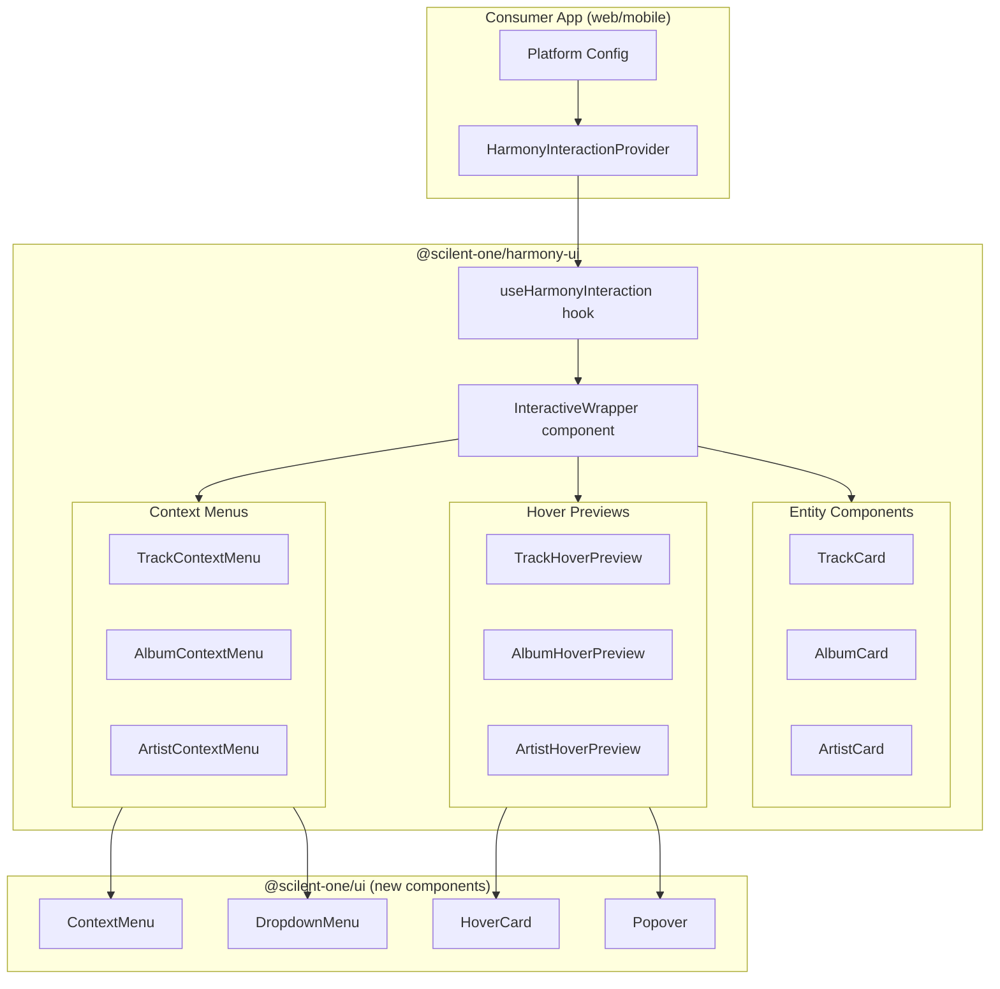

# Harmony UI Interactions System

## Architecture Overview

Create a `HarmonyInteractionProvider` that wraps harmony-ui components and provides configurable interaction behaviors. This provider-based approach allows:

- Platform-specific configuration (web vs mobile)
- Consistent interaction patterns across all entity types (Album, Artist, Track)
- Composable and tree-shakeable - consumers only pay for what they use
- Easy integration in both `@apps/web/` and future mobile apps



## Implementation Plan

### Phase 1: Add Required shadcn Components to UI Package

Add the following components to [`packages/ui/`](packages/ui/):

- `context-menu` - For right-click menus (web)
- `dropdown-menu` - For fallback/mobile long-press menus
- `hover-card` - For hover previews (web)
- `popover` - For tap-to-preview (mobile fallback)

### Phase 2: Create Interaction Provider Infrastructure

Create new files in [`packages/harmony-ui/src/interactions/`](packages/harmony-ui/src/interactions/):

**Core Types** (`types.ts`):

```typescript
type EntityType = 'track' | 'album' | 'artist';
type Platform = 'web' | 'mobile' | 'auto';

interface MenuAction {
	id: string;
	label: string;
	icon?: React.ComponentType;
	href?: string;
	onClick?: () => void;
}

interface HarmonyInteractionConfig {
	platform: Platform;
	enableContextMenu: boolean;
	enableHoverPreview: boolean;
	hoverDelay?: number;

	// Callbacks for navigation/actions
	onNavigate?: (entityType: EntityType, entity: HarmonizedEntity) => void;
	onOpenExternal?: (url: string, platform: string) => void;
	onCopyLink?: (entity: HarmonizedEntity) => void;
	onViewCredits?: (entity: HarmonizedEntity) => void;

	// Custom menu items per entity type
	customMenuItems?: Partial<Record<EntityType, MenuAction[]>>;

	// Preview customization
	previewContent?: Partial<
		Record<EntityType, 'mini' | 'full' | 'links' | React.ComponentType>
	>;
}
```

**Provider** (`provider.tsx`):

```typescript
export const HarmonyInteractionContext =
	createContext<HarmonyInteractionConfig | null>(null);

export function HarmonyInteractionProvider({
	children,
	config,
}: {
	children: React.ReactNode;
	config: HarmonyInteractionConfig;
}) {
	// Auto-detect platform if 'auto'
	// Provide context value
}

export function useHarmonyInteraction() {
	const context = useContext(HarmonyInteractionContext);
	if (!context) {
		// Return safe defaults - interactions disabled
		return { enabled: false };
	}
	return { enabled: true, ...context };
}
```

### Phase 3: Create Entity-Specific Context Menus

Create menu components in [`packages/harmony-ui/src/interactions/menus/`](packages/harmony-ui/src/interactions/menus/):

- `TrackContextMenu.tsx` - Menu for tracks (view track, view album, view artist, external links, copy ISRC)
- `AlbumContextMenu.tsx` - Menu for albums (view album, view artist, external links, copy UPC)
- `ArtistContextMenu.tsx` - Menu for artists (view artist, external links, view discography)
- `EntityMenu.tsx` - Shared wrapper that switches between ContextMenu (web) and DropdownMenu (mobile)

Menu actions based on your selections:

1. Navigate to detail view
2. Open in external platform (Spotify, MusicBrainz, Tidal links from provider sources)
3. Copy link/share
4. View credits/metadata

### Phase 4: Create Configurable Hover Previews

Create preview components in [`packages/harmony-ui/src/interactions/previews/`](packages/harmony-ui/src/interactions/previews/):

- `TrackHoverPreview.tsx` - Configurable track preview
- `AlbumHoverPreview.tsx` - Configurable album preview
- `ArtistHoverPreview.tsx` - Configurable artist preview
- `EntityPreview.tsx` - Shared wrapper using HoverCard (web) or Popover with tap trigger (mobile)

Preview modes (configurable per entity type):

- `mini` - Key stats, small artwork, quick links
- `full` - Expanded card with more metadata
- `links` - Just platform icons/links
- Custom component - Consumer provides their own

### Phase 5: Create Interactive Wrapper Component

Create [`packages/harmony-ui/src/interactions/InteractiveWrapper.tsx`](packages/harmony-ui/src/interactions/InteractiveWrapper.tsx):

```typescript
interface InteractiveWrapperProps {
	entityType: EntityType;
	entity: HarmonizedTrack | HarmonizedRelease | HarmonizedArtist;
	children: React.ReactNode;
}

export function InteractiveWrapper({
	entityType,
	entity,
	children,
}: InteractiveWrapperProps) {
	const interaction = useHarmonyInteraction();

	if (!interaction.enabled) {
		return <>{children}</>;
	}

	// Wrap with appropriate menu + preview based on config
	return (
		<EntityMenu entityType={entityType} entity={entity}>
			<EntityPreview entityType={entityType} entity={entity}>
				{children}
			</EntityPreview>
		</EntityMenu>
	);
}
```

### Phase 6: Update Existing Components (Optional Enhancement)

Optionally update existing components like [`TrackCard`](packages/harmony-ui/src/components/track/TrackCard.tsx), [`AlbumCard`](packages/harmony-ui/src/components/album/AlbumCard.tsx), and [`ArtistCard`](packages/harmony-ui/src/components/artist/ArtistCard.tsx) to include an `interactive` prop that auto-wraps with `InteractiveWrapper`. This keeps backwards compatibility while enabling opt-in enhanced interactions.

### Phase 7: Export and Document

Update [`packages/harmony-ui/src/index.ts`](packages/harmony-ui/src/index.ts) to export:

- `HarmonyInteractionProvider`
- `useHarmonyInteraction`
- `InteractiveWrapper`
- Individual menu/preview components for advanced use cases

---

## Example Usage in Web App

```tsx
// apps/web/src/app/layout.tsx or a providers file
import { HarmonyInteractionProvider } from '@scilent-one/harmony-ui';
import { useRouter } from 'next/navigation';

function HarmonyProvider({ children }) {
	const router = useRouter();

	return (
		<HarmonyInteractionProvider
			config={{
				platform: 'web',
				enableContextMenu: true,
				enableHoverPreview: true,
				hoverDelay: 300,
				onNavigate: (type, entity) => {
					router.push(`/${type}/${entity.id}`);
				},
				onOpenExternal: (url) => window.open(url, '_blank'),
				previewContent: {
					track: 'mini',
					album: 'full',
					artist: 'links',
				},
			}}
		>
			{children}
		</HarmonyInteractionProvider>
	);
}
```

## File Structure

```
packages/harmony-ui/src/
  interactions/
    index.ts                    # Barrel exports
    types.ts                    # TypeScript types
    provider.tsx                # HarmonyInteractionProvider + hook
    InteractiveWrapper.tsx      # Main wrapper component
    menus/
      index.ts
      EntityMenu.tsx            # Platform-adaptive menu wrapper
      TrackContextMenu.tsx
      AlbumContextMenu.tsx
      ArtistContextMenu.tsx
    previews/
      index.ts
      EntityPreview.tsx         # Platform-adaptive preview wrapper
      TrackHoverPreview.tsx
      AlbumHoverPreview.tsx
      ArtistHoverPreview.tsx
```

## Key Design Decisions

1. **Provider Pattern**: Allows platform configuration at the app level while keeping harmony-ui components platform-agnostic

2. **Graceful Degradation**: Components work without the provider (interactions simply disabled), maintaining backwards compatibility

3. **Callback-based Navigation**: The provider receives navigation callbacks rather than hard-coding routes, making it truly reusable across apps

4. **Composable Architecture**: Advanced users can use individual menu/preview components directly; simpler use cases just wrap with `InteractiveWrapper`

5. **Platform Detection**: `platform: 'auto'` uses `useIsMobile()` hook from `@scilent-one/ui` for automatic detection
