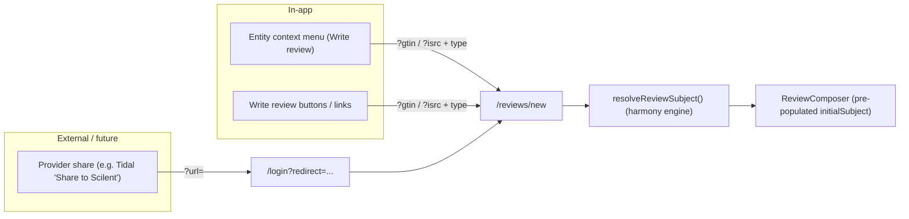

# Review Ingress

How users get into the review composer (`/reviews/new`), and how to extend those entry points.

There is no dedicated `Review` model — reviews are `Post` rows with `type = 'REVIEW'` plus a 1:1
`ReviewSubject` (see `packages/db/prisma/schema.prisma`). A review subject is always a **release**
or **track** (never an artist), identified by GTIN / ISRC / MBID.

## Ingress overview

## `/reviews/new` query-param contract

`apps/web/src/app/(authenticated)/reviews/new/page.tsx` accepts these search params and resolves the
subject server-side via `resolveReviewSubject()` (`apps/web/src/lib/review-subject.ts`) before
rendering `ReviewComposer` with a pre-populated `initialSubject`:

| Param  | Meaning                          | Notes                                                                            |
| ------ | -------------------------------- | -------------------------------------------------------------------------------- |
| `url`  | A provider/entity URL to look up | Tried as a track URL first, then a release URL. Best option for external shares. |
| `gtin` | Release barcode (UPC/EAN)        | Pair with `type=RELEASE`.                                                        |
| `isrc` | Track recording code             | Pair with `type=TRACK`.                                                          |
| `type` | `RELEASE` or `TRACK`             | Disambiguates `gtin`/`isrc` lookups.                                             |

If no params are present, the composer opens empty and the user searches manually via
`MusicSubjectPicker`. If resolution fails, the page shows an error banner and falls back to manual
search. The same resolution logic backs `POST /api/v1/reviews` (`{ subject }` directly, or
`{ url | gtin | isrc, subjectType }`).

## In-app ingress

- **Entity context menus** (right-click on web, long-press on mobile) expose **Write review** and
  **See reviews** on track and album entities. These are wired in
  `apps/web/src/components/harmony-interaction-provider.tsx`:
  - Write review -> `/reviews/new?gtin=...&type=RELEASE` / `?isrc=...&type=TRACK` (with a `?url=`
    fallback when no GTIN/ISRC is available).
  - See reviews -> `/releases/{gtin}/reviews` / `/tracks/{isrc}/reviews`.
- Menus are provided by `@scilent-one/scilent-ui`'s interaction system
  (`packages/scilent-ui/src/interactions/`). Entity cards/list-items opt in via an `interactive`
  prop; the app enables it on the search and artists surfaces today.

## External ingress (future-proofing)

Nothing external is built yet, but the plumbing already supports it: an external share only needs to
open `/reviews/new?url=<providerUrl>`.

- **Auth deep-link survival:** unauthenticated users must be able to reach that URL after signing in.
  The login/signup forms honor a sanitized `?redirect=` param
  (`sanitizeInternalRedirect()` in `apps/web/src/lib/routes.ts`), so a link such as
  `/login?redirect=%2Freviews%2Fnew%3Furl%3D<providerUrl>` lands the user on the pre-populated
  composer after auth. Only same-origin absolute paths are allowed (open-redirect safe).
- **Future work to actually ship "Share to Scilent":**
  - Add a PWA `share_target` entry to the web manifest so the OS share sheet can hand a URL to
    `/reviews/new`.
  - Consider native mobile deep links / universal links mapping to the same route.
  - Normalize provider-specific share URL formats (Tidal, Spotify, Apple Music, etc.) so
    `engine.lookupByUrl()` / `lookupTrackByUrl()` reliably resolves them; extend the harmony engine
    where a provider's public share URL isn't yet recognized.

## Deferred: context menus on review-card subjects

`ReviewCard` / `ReviewSubjectPreview` (`packages/scilent-ui/src/components/review/`) render a subject
using the plain `ReviewSubjectDisplay` shape (title / artistLabel / gtin / isrc strings), **not** a
`HarmonizedRelease` / `HarmonizedTrack`. As a result they can't be wrapped with `InteractiveWrapper`
directly (it expects a `HarmonizedEntity`).

To add context menus / hover previews there later, either:

1. Hydrate a minimal `HarmonizedRelease` / `HarmonizedTrack` from the persisted
   `ReviewSubject.snapshot` JSON (the full harmonized entity is already stored on write), or
2. Teach `InteractiveWrapper` (and the per-entity menus/previews) to accept a lighter entity shape.

Option 1 is preferred since the snapshot data already exists and keeps the interaction components
strongly typed.
